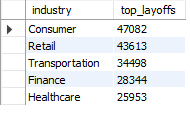
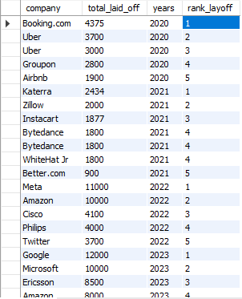
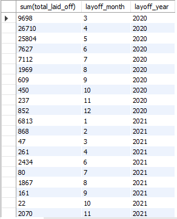
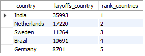
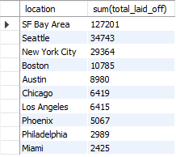
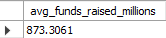
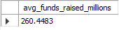
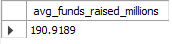
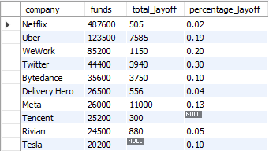
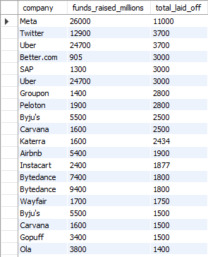

##  Layoffs Overview ##
### Top 5 industries with the most layoffs ###
```sql
SELECT industry, sum(total_laid_off) as top_layoffs
FROM layoffs_staging_2
WHERE industry != "other"
GROUP BY industry
ORDER BY top_layoffs desc
LIMIT 5;
```



### Top 5 companies with the most layoff per year ###

```sql 
WITH t1 as (
  SELECT company, total_laid_off, YEAR(`date`) as years
  FROM layoffs_staging_2
  WHERE total_laid_off IS NOT NULL
  AND YEAR(`date`) IS NOT NULL),
t2 as(
  SELECT *, DENSE_RANK() OVER(partition by years order by total_laid_off DESC) as rank_layoff
  FROM t1
)
SELECT *
FROM t2
WHERE rank_layoff <= 5;
```




## Monthly trend of layoffs ##

```sql
SELECT sum(total_laid_off), MONTH(`date`) as layoff_month, YEAR(`date`) as layoff_year
FROM layoffs_staging_2
where `date` is not null
group by layoff_month, layoff_year
order by layoff_year, layoff_month;
```




## Location Analysis ##
### Most layoff by country outside of the United States ###

```sql
WITH t1 as(
  SELECT country, SUM(total_laid_off) as layoffs_country
  FROM layoffs_staging_2
  WHERE country != "United States"
  GROUP BY country
  ORDER BY layoffs_country DESC),
t2 as (
  SELECT *, rank() over(order by layoffs_country DESC) as rank_countries
  FROM t1)
SELECT *
FROM t2
WHERE rank_countries <= 5;
```



### 10 American cities with the most layovers ###

```sql
select location, sum(total_laid_off)
from layoffs_staging_2
where country = 'United States'
group by location
order by sum(total_laid_off) DESC
limit 10;
```



## Funding Analysis ##
### Relationship between funds raised and percentage of laid off ###
#### AVG funds for companies layoff 0-50% of their personal ####

```sql
SELECT AVG(funds_raised_millions) AS avg_funds_raised_millions
FROM layoffs_staging_2
WHERE total_laid_off IS NOT NULL 
  AND percentage_laid_off IS NOT NULL 
  AND date IS NOT NULL 
  AND funds_raised_millions IS NOT NULL
  AND percentage_laid_off > 0
  AND percentage_laid_off < 0.5;
 ```


#### AVG funds for companies layoff 50-99% of their personal ####
```sql
SELECT AVG(funds_raised_millions) AS avg_funds_raised_millions
FROM layoffs_staging_2
WHERE total_laid_off IS NOT NULL 
  AND percentage_laid_off IS NOT NULL 
  AND date IS NOT NULL 
  AND funds_raised_millions IS NOT NULL
  AND percentage_laid_off > 0.5
  AND percentage_laid_off < 0.99;
```


#### AVG funds for companies layoff 100% of their personal (Total Closure) ####

```sql  
  SELECT percentage_laid_off, AVG(funds_raised_millions) AS avg_funds_raised_millions
FROM layoffs_staging_2
WHERE total_laid_off IS NOT NULL 
  AND percentage_laid_off IS NOT NULL 
  AND date IS NOT NULL 
  AND funds_raised_millions IS NOT NULL
  AND percentage_laid_off = 1;
```


### Companies that Raised Significant Funds but Still Had Layoffs ###

```sql
SELECT company, sum(funds_raised_millions) as funds, sum(total_laid_off) as total_layoff, CAST(AVG(percentage_laid_off) AS DECIMAL (10,2)) as percentage_layoff
FROM layoffs_staging_2
group by company
order by funds DESC
limit 10;
```



### Companies with High Funding and High Layoffs ###

```sql
SELECT company, funds_raised_millions, total_laid_off
FROM layoffs_staging_2
WHERE funds_raised_millions > (SELECT AVG(funds_raised_millions) FROM layoffs_staging_2)
  AND total_laid_off > (SELECT AVG(total_laid_off) FROM layoffs_staging_2)
ORDER BY total_laid_off DESC;
```

